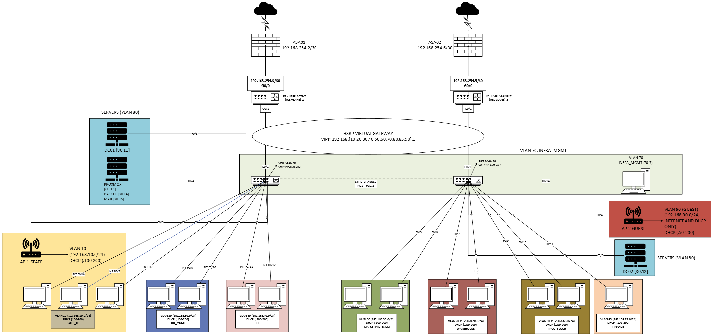

# Network Documentation — Enterprise Network & Systems for Margielos

> **Purpose:** Full technical design + implementation notes for the Margielos enterprise network build (Cisco routing/switching + ASA edge + Windows core services).  
> **Audience:** Network Engineer / Sysadmin reviewers, and administrators who need to operate or troubleshoot this build.

## Quick repo navigation
- **README (high-level overview):** `../README.md`
- **Validation (test plan + results):** `./validation.md`
- **Runbook (ops + troubleshooting):** `./runbook.md`
- **Configs (device configs by role):** `../configs/`
- **Evidence (show-commands, screenshots):** `../evidence/`

---

## Executive summary
**What I built**
- **10 VLANs + VLAN 999 (native/blackhole)** on a collapsed-core **dual-switch** design.
- **Inter-VLAN routing via dual-router router-on-a-stick**, with **HSRPv2** providing redundant default gateways (VIP `.1` per VLAN).
- **ASA edge** for Internet egress via **PAT/NAT**, plus **AnyConnect remote-access VPN** for secure admin access (split tunnel).
- **Centralized DHCP/DNS** from dual Windows DCs using **DHCP relay (`ip helper-address`)** across VLANs.

**Why this design**
- Keeps the core switches simple (**L2 only** for user VLANs) while routers handle **L3 gateways and policy**.
- Adds practical HA at the gateway with HSRP and reduces single points of failure in a small enterprise footprint.
- Enforces meaningful segmentation (Guest internet-only; Warehouse/Prod restricted east-west) without over-engineering.

**How to verify**
- Evidence and validation outputs are indexed in `docs/validation.md` and stored under `evidence/` (e.g., HSRP, trunks/EtherChannel, ACL behavior, DHCP relay, NAT).

---

## Environment & constraints
- Single-site small enterprise simulation (15 users) built in a lab environment.
- Internet egress is provided via upstream lab uplink; ASAs obtain outside addressing via DHCP.
- Focus is realistic design + repeatable validation, not “provider-grade” routing complexity.

## 1. Introduction & Scope

### 1.1 Business context (brief)
**Margielos** is a small e-commerce clothing company (Winnipeg, MB) operating from a **single site** with approximately **15 users** across:
Sales/CS, Warehouse, HR/Management, IT, Marketing/E-Commerce, Production, Finance, and Guests.

### 1.2 Goals
- **Segmentation:** Department VLANs + dedicated **Servers (VLAN 80)** and **Infra Mgmt (VLAN 70)**.
- **High availability:** Redundant default gateways using **HSRPv2** across **R1/R2**.
- **Enterprise edge:** **ASA-based** Internet egress via NAT; no inbound public services exposed.
- **Central services integration:** DHCP/DNS delivered from dual DCs with DHCP relay on router subinterfaces.
- **Security & hardening:** ACL-based segmentation (Guest internet-only; restricted east-west for select VLANs) and L2/Mgmt-plane hardening.

### 1.3 Scope of this document
This document covers the **networking design + implementation**:
- Topology (logical/physical overview)
- VLAN/IP plan and conventions
- Inter-VLAN routing + HSRP gateway redundancy
- ASA edge integration (NAT + remote-access VPN)
- ACL policy intent and where enforcement occurs
- Switch/router hardening controls

**Server build details** (AD DS/DNS/DHCP configuration, GPOs, backup tooling) are covered operationally in:
- `docs/runbook.md` (ops/troubleshooting)  
…and validated outcomes appear in:
- `docs/validation.md`

## 2. Network Topology & Design

### 2.1 Architecture overview
The network uses a **collapsed core** with L2 switching at the core and L3 gateways on the routers:

- **Core switching (SW1/SW2):**
  - Layer 2 for user VLANs
  - **LACP EtherChannel (Po1)** trunk between SW1 and SW2
  - Trunks carry VLANs **10,20,30,40,50,60,70,80,85,90** with **native VLAN 999**

- **Routing (R1/R2):**
  - Router-on-a-stick subinterfaces provide VLAN gateways
  - **HSRP VIP `.1`** is the default gateway per VLAN
  - ACL policy is applied at the routed edge (router subinterfaces)

- **Internet edge (ASA01/ASA02):**
  - ASAs perform NAT to the upstream lab uplink
  - Router default routes point to their respective ASA inside interfaces
  - ASA01 also terminates **AnyConnect** remote-access VPN (split tunnel)

> **VLANs/IP plan:** See **Section 3** for the authoritative table.

---

### 2.2 Logical topology diagram

---

### 2.3 Physical topology
Physical connectivity is intentionally simple:
- **R1 ↔ SW1:** 802.1Q trunk (router-on-a-stick)
- **R2 ↔ SW2:** 802.1Q trunk (router-on-a-stick)
- **SW1 ↔ SW2:** LACP EtherChannel trunk (Po1)
- **R1 ↔ ASA01** and **R2 ↔ ASA02:** /30 inside transit links
- **ASA outside** connects to upstream lab uplink(s)

Detailed port-by-port cabling / patching is recorded in the **runbook**:
- `docs/runbook.md` → *Build Sheet / Port Map*

---

### 2.4 Physical topology diagram

---

### 2.5 Wireless (summary)
- **Staff Wi-Fi:** mapped to VLAN 10  
- **Guest Wi-Fi:** mapped to VLAN 90 (Guest internet-only policy enforced via routed ACLs)

Wireless design details are in **Section 8**.

---

## 3. IP Addressing & Core Services (Networking View)

### 3.1 IP plan
Conventions:
- **Gateway (HSRP VIP):** `.1`
- **R1 subinterface:** `.2`
- **R2 subinterface:** `.3`
- **DHCP pools:** `192.168.10.100–192.168.10.200` (Guest uses `192.168.90.50–192.168.90.200`)
- **Servers (VLAN 80):** `.11–.19`static infrastructure IP range

| VLAN | Name            | Subnet            | Gateway (VIP)     | DHCP Scope         | Notes |
|------|-----------------|-------------------|-------------------|-------------------|------|
| 10   | SALES_CS        | 192.168.10.0/24   | 192.168.10.1      | 10.100–10.200     | Staff wired + staff Wi-Fi |
| 20   | WAREHOUSE       | 192.168.20.0/24   | 192.168.20.1      | 20.100–20.200     | Restricted east-west via ACL |
| 30   | HR_MGMT         | 192.168.30.0/24   | 192.168.30.1      | 30.100–30.200     | Trusted VLAN |
| 40   | IT              | 192.168.40.0/24   | 192.168.40.1      | 40.100–40.200     | Admin/support access |
| 50   | MARKETING_ECOM  | 192.168.50.0/24   | 192.168.50.1      | 50.100–50.200     | Trusted VLAN |
| 60   | PROD_FLOOR      | 192.168.60.0/24   | 192.168.60.1      | 60.100–60.200     | Restricted east-west via ACL |
| 70   | INFRA_MGMT      | 192.168.70.0/24   | 192.168.70.1      | 70.100–70.200     | Mgmt SSH allowed from VLAN 70 and VPN subnet (10.10.10.0/24). |
| 80   | SERVERS         | 192.168.80.0/24   | 192.168.80.1      | N/A (static)      | DCs + infrastructure |
| 85   | FINANCE         | 192.168.85.0/24   | 192.168.85.1      | 85.100–85.200     | Trusted VLAN |
| 90   | GUEST           | 192.168.90.0/24   | 192.168.90.1      | 90.50–90.200      | Internet-only; DHCP allowed |
| 999  | BLACKHOLE/NATIVE| N/A  | N/A               | N/A               | Native VLAN on trunks; unused ports |

---

### 3.2 Core services placement
All core servers live in **VLAN 80 (SERVERS)**. Key infrastructure IPs:
- **DC01:** 192.168.80.11 (AD DS/DNS/DHCP)
- **DC02:** 192.168.80.12 (AD DS/DNS/DHCP)
- **Proxmox:** 192.168.80.13
- **Backup VM:** 192.168.80.14

---

### 3.3 DHCP relay design
DHCP is centralized on DC01/DC02, so clients in all VLANs rely on DHCP relay:
- Each routed VLAN subinterface on **R1 and R2** includes:
  - `ip helper-address 192.168.80.11`
  - `ip helper-address 192.168.80.12`

Expected client outcome (validated in `docs/validation.md`):
- Correct subnet lease
- Default gateway = VIP `.1`
- DNS = DC01/DC02

---

### 3.4 Internal DNS / AD namespace (networking reference)
- AD/DNS domain: `ict.margielos.uk`
- Clients receive DNS servers via DHCP:
  - 192.168.80.11 (DC01), 192.168.80.12 (DC02)

Server-side DHCP failover and DNS zone configuration details are documented operationally in `docs/runbook.md`.

---

## 4. Gateway Redundancy - HSRP

### 4.1 Objective
Provide redundant default gateways for all routed VLANs so that:
- Endpoints use a single, stable default gateway per VLAN (HSRP VIP).
- If R1 fails, or if R1 loses upstream connectivity, R2 can assume the Active gateway role with minimal disruption.

### 4.2 Design Summary
- **Protocol:** HSRPv2
- **Devices:** R1 (preferred Active), R2 (standby)
- **Model:** Dual-router router-on-a-stick (one subinterface per VLAN on both routers)
- **Groups:** One HSRP group per VLAN, **group number = VLAN ID**
- **Client gateway:** HSRP **VIP = .1** per VLAN (reference Section 3 VLAN/IP plan)
- **Router IP convention:** **R1 = .2**, **R2 = .3** per VLAN (reference Section 3)
- **VLANs using HSRP:** 10, 20, 30, 40, 50, 60, 70, 80, 85, 90
- **Excluded VLAN:** `999` (native/blackhole). No hosts, no HSRP.

### 4.3 Addressing Pattern (ties to Section 3)
For each routed VLAN `X`:
- **VIP (default gateway):** `192.168.X.1`
- **R1:** `192.168.X.2`
- **R2:** `192.168.X.3`
- **HSRP group:** `X`

Example (VLAN 10):
- VIP `192.168.10.1`, R1 `192.168.10.2`, R2 `192.168.10.3`, group `10`

### 4.4 Failover Behavior
- **R1 is preferred Active** using higher HSRP priority:
  - **R1 priority:** 110
  - **R1 preempt:** enabled
- **R2 standby priority:** 100
- **Uplink tracking on R1:**
  - R1 tracks its upstream/WAN interface (`Gi0/0`) using `track 1 decrement 20`
  - If the tracked uplink fails, R1 priority drops (110 → 90), allowing R2 (100) to become Active
- **Timers:** Default HSRP timers are used (3s hello, 10s hold)

### 4.5 Security and Service Continuity
- **HSRP authentication:** MD5 authentication enabled on all HSRP groups
- **DHCP continuity:** DHCP relay is configured on both routers’ VLAN subinterfaces (reference Section 3.3) so DHCP remains available during HSRP failover

### 4.6 Assumptions and Limitations
- Only R1’s uplink is tracked. If R2 loses its uplink while Active, failover behavior depends on R1 health and current HSRP state.
- HSRP provides default-gateway redundancy. It does not provide end-to-end path optimization. Dynamic routing is outside the scope of this build.

---

## 5. Inter-VLAN Routing & Default Route

### 5.1 Objective
Document how the network provides:
- Layer 3 connectivity between internal VLANs
- A consistent path to the Internet edge
- Continuity during gateway failover (HSRP)

Architecture placement is covered in **Section 2**. VLAN/IP plan and DHCP relay are covered in **Section 3**. HSRP behavior is covered in **Section 4**.

---

### 5.2 Design Overview (Routing Model)
- **Model:** Dual-router router-on-a-stick
- **Core switching:** SW1/SW2 operate as **Layer 2** for user VLANs. Inter-switch resiliency is provided by EtherChannel trunking (see **Section 2**).
- **Gateways and routing:** R1/R2 provide the VLAN default gateways and perform inter-VLAN routing (see **Section 4** for gateway redundancy details).
- **Internet egress:** Each router forwards Internet-bound traffic to its respective ASA firewall using a static default route (see **Section 6** for transit addressing and NAT).

No internal dynamic routing protocol is used. This environment is small enough that static defaults plus per-VLAN subinterfaces remain simple and predictable.

---

### 5.3 VLAN Routing Implementation (What matters operationally)
- **One 802.1Q trunk per router** to the core, carrying VLANs 10,20,30,40,50,60,70,80,85,90 with native VLAN 999 (see **Section 2**).
- **One subinterface per VLAN** on both routers.
- **IP addressing pattern is consistent across VLANs** (see **Section 3.1**):
  - HSRP VIP: `.1`
  - R1: `.2`
  - R2: `.3`
- **DHCP relay is on both routers** so DHCP remains available during HSRP failover (see **Section 3.3**).
- **Traffic policy is enforced at the router subinterfaces via ACLs** (see **Section 7**).

> Interface-level naming and port mapping (exact router/switch interfaces) is documented in `docs/runbook.md`.

---

### 5.4 Default Routing and Internet Path
Each router forwards Internet-bound traffic to its local ASA using a static default route:
- R1 → ASA01
- R2 → ASA02

Transit addressing, ASA routing, and NAT policy are documented in **Section 6**.

---

### 5.5 Traffic Flow Summary
1. Host sends traffic to its VLAN gateway (HSRP VIP `.1`).
2. Active router receives the packet on the VLAN subinterface.
3. Router decision:
   - Destination is another internal VLAN → route internally (subject to ACLs, see Section 7)
   - Destination is Internet → forward to ASA via default route (see Section 6)
4. If the Active gateway changes due to HSRP failover, the host default gateway stays the same (`.1`). Only the Active router changes (see Section 4).

---

### 5.6 Assumptions & Limitations
- HSRP provides **default-gateway redundancy**, not end-to-end multi-path routing.
- Static default routing is used by design. No IGP is deployed internally.
- Upstream routing and public addressing are handled at the ASA edge (see Section 6).

---

### 5.7 Validation Pointers
Validation evidence and expected outputs are documented in `docs/validation.md`, including:
- HSRP state and failover behavior
- Inter-VLAN routing reachability
- DHCP relay behavior per VLAN
- Internet reachability via ASA NAT

---

## 6. NAT & Internet Edge

### 6.1 Objective
Describe how internal VLANs reach the Internet through the ASA edge, including:
- Router-to-firewall transit links and routing handoff
- NAT/PAT policy on ASA01 and ASA02
- Remote-access VPN termination (AnyConnect)

End-to-end traffic flow (host → gateway → routing decision) is summarized in **Section 5.5**. VLAN policy intent is covered in **Section 7**.

---

### 6.2 Edge Design Summary
The design uses **ASA firewalls as the Internet edge**, while routers focus on **inter-VLAN routing and default routing to the firewalls**:
- **R1 routes VLANs and forwards default traffic to ASA01**
- **R2 routes VLANs and forwards default traffic to ASA02**
- **ASA01/ASA02 perform NAT (PAT) and egress to the upstream uplink**

This keeps the responsibilities clear:
- Routers: VLAN gateways, inter-VLAN routing, ACL enforcement (see Sections **4, 5, 7**)
- Firewalls: NAT and Internet edge policy (this section)

Note: Router-facing subinterfaces may still be marked as `ip nat inside`, but there are **no active router NAT translation rules** in the final design. NAT occurs only on the ASAs to avoid double NAT.

---

### 6.3 Router-to-Firewall Transit Links and Default Routes
Each router connects to its ASA using a dedicated /30 transit network and installs a static default route to the firewall inside IP.

**R1 ↔ ASA01 transit**
- R1 `Gi0/0`: `192.168.254.1/30`
- ASA01 `Gi1/2` (inside): `192.168.254.2/30`
- R1 default route:
  - `ip route 0.0.0.0 0.0.0.0 192.168.254.2`

**R2 ↔ ASA02 transit**
- R2 `Gi0/0/0`: `192.168.254.5/30`
- ASA02 `Gi1/2` (inside): `192.168.254.6/30`
- R2 default route:
  - `ip route 0.0.0.0 0.0.0.0 192.168.254.6`

**Return routing on ASAs**
Each ASA includes an inside route for internal subnets via its connected router:
- ASA01: `route inside 192.168.0.0 255.255.0.0 192.168.254.1 1`
- ASA02: `route inside 192.168.0.0 255.255.0.0 192.168.254.5 1`

---

### 6.4 ASA01 - Primary Internet Edge (R1 Path)

**Interfaces**
- Outside (`Gi1/1`, `nameif outside`):
  - `ip address dhcp setroute` (DHCP addressing plus default route installed by ASA)
- Inside (`Gi1/2`, `nameif inside`):
  - `ip address 192.168.254.2 255.255.255.252` (to R1)

Optional outside-backup (`Gi1/3`, `nameif outside-backup`) is present and uses DHCP, but is not required for baseline operation.

**NAT policy (dynamic PAT)**
- Internal coverage object:
  - `object network OBJ_INSIDE_ALL`
  - `subnet 192.168.0.0 255.255.0.0`
- Dynamic PAT to outside interface:
  - `nat (inside,outside) dynamic interface`
  - `1 (inside) to (outside) source dynamic OBJ_INSIDE_ALL interface`

**Important behavior note**
- Guest traffic (VLAN 90) uses the same NAT policy as internal users.
- Guest isolation is enforced by routed ACLs on the routers, not separate ASA zones (see **Section 7**).

---

### 6.5 ASA02 - Secondary Internet Edge (R2 Path)
ASA02 mirrors the ASA01 design to provide an independent edge for the R2 path.

**Interfaces**
- Outside (`Gi1/1`, `nameif outside`):
  - `ip address dhcp setroute`
- Inside (`Gi1/2`, `nameif inside`):
  - `ip address 192.168.254.6 255.255.255.252` (to R2)

**NAT policy**
- Internal coverage object:
  - `object network INSIDE-NET`
  - `subnet 192.168.0.0 255.255.0.0`
- Dynamic PAT to outside interface:
  - `nat (inside,outside) dynamic interface`

Operationally:
- Normal path uses R1 → ASA01.
- ASA02 remains configured and ready so Internet egress can continue via R2 during failover scenarios.

---

### 6.6 Internet Access Control (Where policy lives)
NAT is intentionally uniform for internal subnets. Effective access is controlled by router ACLs:
- Guest VLAN is Internet-only and blocked from internal RFC1918 ranges (see **Section 7**)
- Warehouse and Production are restricted east-west but can reach Servers and Internet (see **Section 7**)

---

### 6.7 Remote-Access VPN (ASA01 AnyConnect)
**Environment constraint:** Remote-access VPN depends on the ASA outside interface being reachable from the client. In this environment, the ASA outside interface receives addressing via upstream DHCP and does not have consistent public inbound reachability. AnyConnect was validated only when the client had network reachability to the ASA outside interface (for example, when connected within the upstream environment).

**Development access note (out of scope):** During build and troubleshooting, I used a Tailscale overlay to reach the lab environment remotely from home. This was used for development continuity and was not part of the baseline network design, security policy, or validation evidence in this repo.

ASA01 also terminates remote-access VPN for secure admin access:
- VPN pool: `VPN_POOL 10.10.10.10–10.10.10.50 /24`
- Split tunnel policy: “tunnelspecified”
- Split tunnel ACL includes internal VLAN subnets (VLANs 10,20,30,40,50,60,70,80,85,90)

VPN design intent and operational use is referenced in `docs/runbook.md` where troubleshooting and access procedures live.

---

### 6.8 Assumptions & Limitations
- Upstream IP addressing on ASA outside is DHCP-provided; no static public IP requirement.
- No inbound public services are published from the edge in this baseline build.
- The edge is designed for clarity and validation: routers route and enforce VLAN policy, ASAs NAT and provide the Internet boundary.

---

### 6.9 Validation Pointers
Validation evidence and expected outputs are documented in `docs/validation.md`, including:
- Internet reachability from multiple VLANs
- NAT translations on ASA
- Guest isolation behavior (Internet allowed, internal denied)
- Failover readiness (HSRP gateway continuity plus alternate edge path)

---

## 7. ACLs & Security Policy

### 7.1 Objectives
This section documents the **traffic policy intent** and where it is enforced. The goals are:
- Reduce unnecessary east-west access between departments
- Provide **Guest internet-only** while still allowing DHCP
- Protect the network device management plane (SSH access restricted to management networks)

Routing model and gateway behavior are covered in **Sections 4 and 5**. ASA edge and NAT are covered in **Section 6**. L2 and device hardening baselines are covered in **Section 9**.

---

### 7.2 Enforcement Points (Where policy lives)
Policy enforcement is intentionally placed at the routed edge:
- **R1/R2 router subinterfaces** enforce inter-VLAN policy using inbound ACLs on selected VLANs.
- **VTY access-class** restricts who can SSH to routers and switches (management plane control).
- **ASA NAT** provides Internet egress. Segmentation is primarily enforced on the routers, not by ASA zone separation (see Section 6).

Exact interface names and where ACLs are applied are documented in `docs/runbook.md`.

---

### 7.3 ACL Inventory 
| ACL Name        | Type      | Applied Where            | Direction | Purpose |
|----------------|-----------|--------------------------|-----------|---------|
| `GUEST_IN`     | Extended  | VLAN 90 router subif     | Inbound   | Guest DHCP allowed, internal RFC1918 denied, Internet allowed |
| `WAREHOUSE_IN` | Extended  | VLAN 20 router subif     | Inbound   | Warehouse limited to Servers + Internet, blocks other internal VLANs |
| `PROD_IN`      | Extended  | VLAN 60 router subif     | Inbound   | Production limited to Servers + Internet, blocks other internal VLANs |
| `MGMT_VTY`     | Standard  | VTY lines (routers, sw)  | Inbound   | SSH management allowed only from mgmt subnets |
| `NAT_INSIDE`   | Standard  | Defined on routers        | N/A       | Documents internal ranges. Router NAT is not used in final design (see Section 6) |

---

### 7.4 Effective Policy Summary by VLAN (Initiated traffic)
This table summarizes what a host in each VLAN can initiate. Return traffic is allowed where stateful behavior applies (ASA), and routing behavior follows Sections 4 and 5.

| VLAN | Name           | To Servers (80) | To Other Internal VLANs | To Internet | Notes |
|------|----------------|-----------------|--------------------------|------------|------|
| 10   | SALES_CS       | Allowed         | Allowed                  | Allowed     | No VLAN-specific ACL in this design |
| 20   | WAREHOUSE      | Allowed         | Denied (except 80)       | Allowed     | Enforced by `WAREHOUSE_IN` |
| 30   | HR_MGMT        | Allowed         | Allowed                  | Allowed     | Trusted VLAN in this design |
| 40   | IT             | Allowed         | Allowed                  | Allowed     | Admin/support access |
| 50   | MARKETING_ECOM | Allowed         | Allowed                  | Allowed     | Trusted VLAN in this design |
| 60   | PROD_FLOOR     | Allowed         | Denied (except 80)       | Allowed     | Enforced by `PROD_IN` |
| 70   | INFRA_MGMT     | Allowed         | Allowed                  | Allowed     | Primary management VLAN (MGMT_VTY also allows VPN subnet). |
| 80   | SERVERS        | N/A             | Allowed                  | Allowed     | Shared services for all VLANs |
| 85   | FINANCE        | Allowed         | Allowed                  | Allowed     | Trusted VLAN in this design |
| 90   | GUEST          | Denied          | Denied                   | Allowed     | Enforced by `GUEST_IN` (DHCP permitted, internal denied) |

---

### 7.5 Guest Policy Details (VLAN 90)
The Guest VLAN is designed to be **Internet-only** while still supporting DHCP.
`GUEST_IN` is applied inbound on the VLAN 90 router subinterface with intent:
- Permit DHCP to DC01/DC02 (VLAN 80) so clients can obtain leases
- Deny access to internal networks (192.168.0.0/16)
- Permit all remaining traffic to the Internet

Validation expectation: Guest clients receive a lease and can reach Internet destinations, but cannot reach internal subnets (see `docs/validation.md`).

---

### 7.6 Restricted East-West VLANs (Warehouse and Production)
Warehouse (VLAN 20) and Production (VLAN 60) are restricted to reduce lateral movement:
- Permit access to **Servers VLAN (80)** for required services
- Deny access to other internal VLANs
- Permit Internet access for updates and external services

Enforced by:
- `WAREHOUSE_IN` on VLAN 20 subinterface (inbound)
- `PROD_IN` on VLAN 60 subinterface (inbound)

---

### 7.7 Management Plane Protection (SSH access control)
Device management is restricted to management networks using a VTY access-class:
- `MGMT_VTY` permits management sources:
  - `192.168.70.0/24` (INFRA_MGMT)
  - `10.10.10.0/24` (VPN management subnet)
- All other sources are denied for VTY access

This ensures user VLANs and Guest VLAN cannot directly manage routers/switches even if routing allows other traffic.

SSH-only and related hardening controls are documented in **Section 9**.

---

### 7.8 Layer 2 Security Controls (Summary, referenced)
L2 hardening supports the segmentation model but is documented in depth in **Section 9**:
- Native/blackhole VLAN 999 and unused port handling
- STP protections (PortFast, BPDU Guard)
- Port-security on selected access ports

---

### 7.9 Features Tested but Not Enabled (Documented)
DHCP Snooping and Dynamic ARP Inspection (DAI) were tested but are not active in the final baseline due to DHCP stability issues observed during testing. This is kept as documented future work rather than an enabled control.

Details and current status are documented in **Section 9.5**.

---

## 8. WLAN Design

### 8.1 Objective
Provide limited, practical wireless access using two standalone access points:
- Staff SSID mapped to an internal VLAN
- Guest SSID mapped to the Guest VLAN for BYOD and visitors

Primary access remains wired. Wi-Fi supports BYOD and occasional mobility.

---

### 8.2 Wireless Infrastructure Overview
- Two standalone APs in AP mode (no routing, no NAT, no controller)
- Each AP is connected as a switch access port in the target VLAN
- DHCP/DNS/gateway redundancy and segmentation are provided by the existing wired design (see Sections 3, 4, and 7)

Exact port mappings are recorded in `docs/runbook.md` (port map).

---

### 8.3 SSIDs and VLAN Mapping
| SSID              | VLAN | Intended Users                              | Security |
|-------------------|------|---------------------------------------------|----------|
| Margielos Staff   | 10   | Approved staff BYOD / internal staff        | WPA2-PSK (WPA3 where supported) |
| Margielos Guest   | 90   | Guests and BYOD (incl. Warehouse/Production)| WPA2-PSK (WPA3 where supported) |

Pre-shared keys are managed internally and not documented in this report.

---

### 8.4 Segmentation Behavior (Reference)
Wireless clients are normal VLAN clients:
- Staff Wi-Fi (VLAN 10) inherits VLAN 10 addressing, gateway redundancy (HSRP), and policy (see Sections 3, 4, 7)
- Guest Wi-Fi (VLAN 90) is internet-only by routed ACL policy, while still allowing DHCP (see Sections 3.3 and 7.5)

---

## 9. Switch & Router Hardening

### 9.1 Objective
Define the baseline hardening controls applied to routers and switches to:
- Reduce exposed management surfaces
- Prevent common Layer 2 failure modes (loops, rogue switches)
- Limit casual misuse of access ports
- Improve operational consistency and troubleshooting

Traffic policy intent and enforcement points are documented in **Section 7**. This section focuses on the *hardening implementation baseline*.

---

### 9.2 Router Hardening Baseline (R1, R2)

#### 9.2.1 Local authentication and login controls
- Minimum password length enforced:
  - `security passwords min-length 10`
- Password obfuscation enabled in config output:
  - `service password-encryption`
- Encrypted enable secret is used (not plaintext enable password)
- Local admin account used for SSH access (example: `azuremaster`)
- Brute-force mitigation:
  - `login block-for 60 attempts 5 within 60`
- MOTD banner enabled to provide an access warning (`banner motd`)

#### 9.2.2 Management plane controls (SSH-only)
- SSHv2 enabled:
  - `ip ssh version 2`
- VTY lines restricted to SSH only:
  - `transport input ssh`
- Web management disabled:
  - `no ip http server`
  - `no ip http secure-server`

#### 9.2.3 VTY source restriction (MGMT_VTY)
Management access is restricted using a VTY `access-class` ACL:
- `MGMT_VTY` permits:
  - `192.168.70.0/24` (INFRA_MGMT)
  - `10.10.10.0/24` (VPN management subnet)
- Applied inbound to VTY lines:
  - `access-class MGMT_VTY in`

Policy intent and VLAN context for INFRA_MGMT and VPN management are documented in **Section 7.7**.

#### 9.2.4 Control-plane and information exposure
- HSRP authentication is enabled (see **Section 4** for redundancy behavior)
- CDP disabled to reduce topology leakage:
  - `no cdp run`
- Routed ACLs enforce VLAN segmentation and Guest isolation (documented in **Section 7**)

---

### 9.3 Switch Hardening Baseline (SW1, SW2)

#### 9.3.1 Management baseline
- Password obfuscation and access warning banner:
  - `service password-encryption`
  - `banner motd`
- Disable web management:
  - `no ip http server`
  - `no ip http secure-server`
- Disable DNS lookup on mistyped commands:
  - `no ip domain-lookup`
- SSHv2 enabled and VTY restricted to SSH:
  - `ip ssh version 2`
  - VTY: `login local`, `transport input ssh`
- CDP disabled:
  - `no cdp run`

#### 9.3.2 Access port control (port-security)
Port-security is enabled on selected access ports where fixed endpoints are expected:
- `switchport port-security`
- `switchport port-security maximum 2`
- `switchport port-security violation restrict`
- `switchport port-security mac-address sticky`

This balances security and operational usability in a small enterprise footprint.

---

### 9.4 Layer 2 Stability and Edge Protection

#### 9.4.1 STP edge protections
Applied on edge/access ports where end-hosts are expected:
- `spanning-tree portfast`
- `spanning-tree bpduguard enable`

Uplinks and trunks (router trunks and EtherChannel) are not treated as edge ports.

#### 9.4.2 Blackhole VLAN and unused ports
- VLAN 999 is used as a blackhole/native VLAN strategy:
  - Native VLAN on trunks is set to VLAN 999
  - Unused access ports are assigned to VLAN 999 and administratively shut down:
    - `switchport access vlan 999`
    - `shutdown`

This reduces VLAN hopping risk and limits accidental connectivity on spare ports.

---

### 9.5 Features Evaluated but Not Enabled in Baseline
The following features were tested but are not active in the final baseline due to DHCP stability issues observed during testing:

- **DHCP Snooping**
  - Tested with trusted/untrusted boundaries and rate limiting
  - Result: DHCP failures observed across multiple VLANs
  - Final baseline: DHCP Snooping is not globally enabled

- **Dynamic ARP Inspection (DAI)**
  - Evaluated alongside DHCP Snooping
  - Result: contributed to connectivity and DHCP issues in testing
  - Final baseline: DAI is not active

These are documented as future hardening work once bindings/trust boundaries are fully validated.

---

### 9.6 Verification Pointers (Operational Checks)
Validation results and evidence outputs are documented in `docs/validation.md` and stored under `evidence/`. Quick checks that map to this section:

**Routers**
- SSH-only: confirm VTY has `transport input ssh`
- Source restriction: confirm `access-class MGMT_VTY in`
- HTTP disabled: confirm `no ip http server` and `no ip http secure-server`
- CDP disabled: confirm `no cdp run`
- HSRP auth present: confirm standby authentication on HSRP groups (see Section 4)

**Switches**
- Trunk native VLAN 999: `show interfaces trunk`
- EtherChannel health: `show etherchannel summary`
- PortFast/BPDU Guard state: `show spanning-tree interface detail`
- Port-security: `show port-security interface <x>`
- Unused ports: confirm VLAN 999 assignment and shutdown state where intended

---

## 10. Roadmap (future enhancements)
- Re-introduce DHCP Snooping and Dynamic ARP Inspection with validated trust boundaries and bindings
- Add centralized syslog/SIEM logging and retention
- Expand monitoring (SNMP/telemetry) and alerting
- Add a branch/IGP scenario (OSPF) for route exchange and failover validation (if/when multi-site is added)
